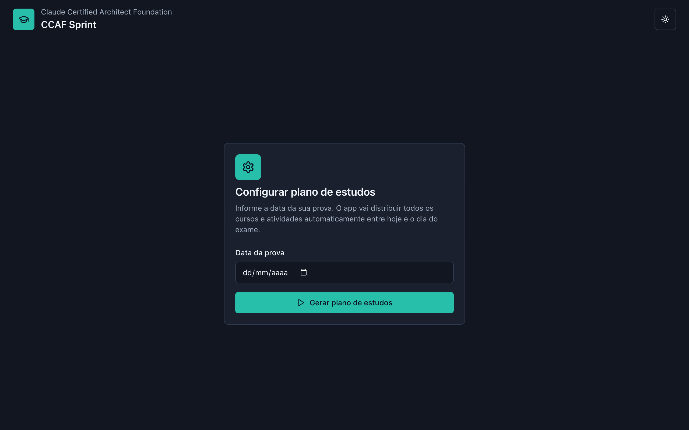
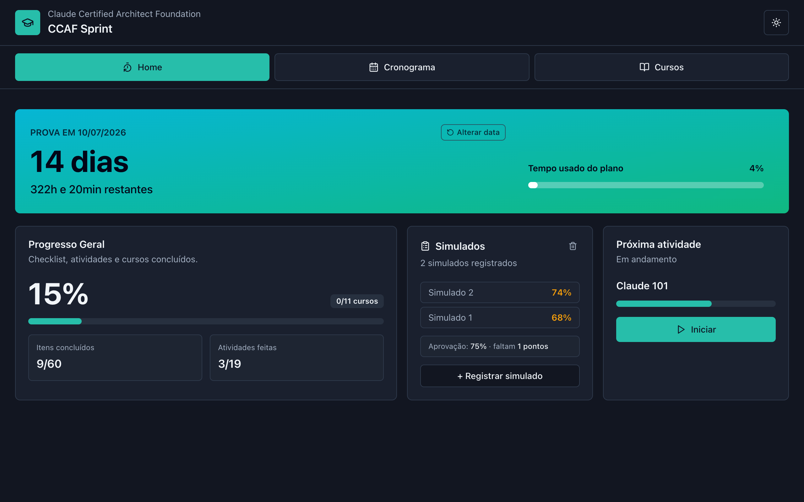
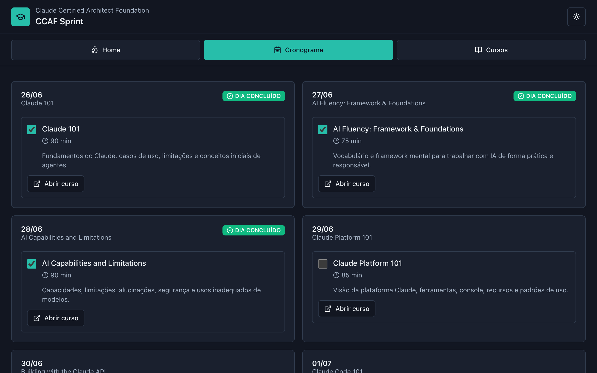
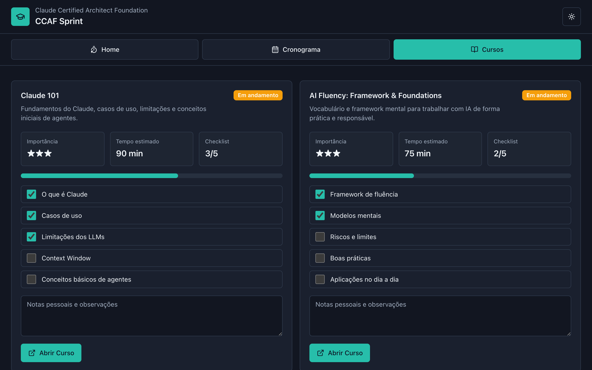
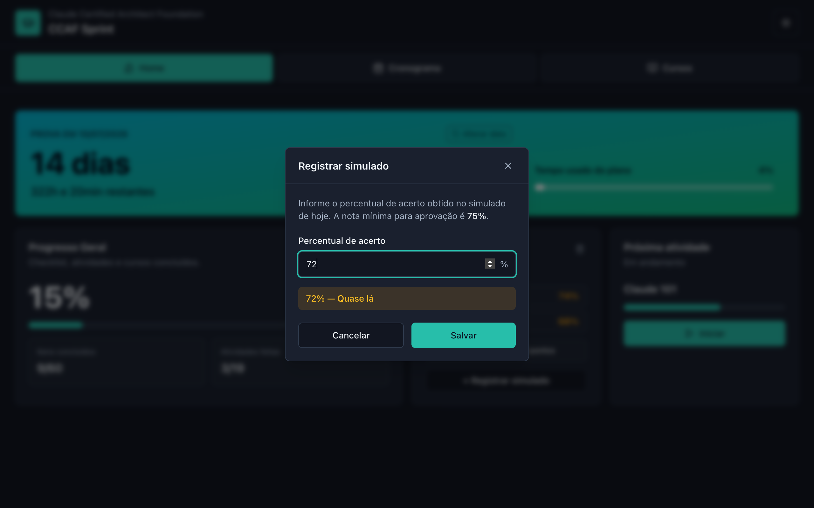
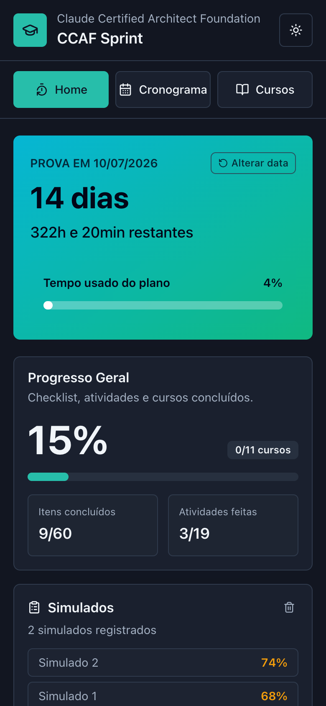

# CCAF Sprint

> **Study dashboard for the Claude Certified Architect Foundation (CCAF) exam.**  
> Pick your exam date, get a personalised study schedule, track checklist progress, and log mock exam scores — all stored locally in your browser.

---

## Screenshots

| Setup | Home |
|-------|------|
|  |  |

| Schedule | Courses |
|----------|---------|
|  |  |

| Mock score dialog | Mobile |
|------------------|--------|
|  |  |


---

## Features

### 🗓 Smart schedule generator
Set your exam date once. The app calculates how many days you have and automatically fills every single day with meaningful work — no empty slots.

| Available study days | Strategy |
|---|---|
| ≤ 11 | **Short** — multiple courses packed per day via round-robin |
| 12 – 32 | **Medium** — one course per day, extra days filled with targeted review of the highest-priority courses |
| 33 + | **Long** — every course gets three dedicated sessions (1st pass → deep dive → review), remaining days filled with practice prompts |

The last 3 days are always reserved:

- **N-2** — Full review + first mock exam (target ≥ 75%)
- **N-1** — Gap correction + final mock exam (target ≥ 80%)
- **N** — Exam day (light review + the exam itself)

### 📚 11-course curriculum in recommended order

| # | Course | Importance |
|---|--------|-----------|
| 1 | Claude 101 | ★★★ |
| 2 | AI Fluency: Framework & Foundations | ★★★ |
| 3 | AI Capabilities and Limitations | ★★★★ |
| 4 | Claude Platform 101 | ★★★★ |
| 5 | **Building with the Claude API** | ★★★★★ |
| 6 | Claude Code 101 | ★★★★ |
| 7 | **Claude Code in Action** | ★★★★★ |
| 8 | Introduction to MCP | ★★★★ |
| 9 | Introduction to Agent Skills | ★★★★ |
| 10 | Introduction to Subagents | ★★★★ |
| 11 | MCP: Advanced Topics | ★★★ |

### ✅ Per-course checklist & notes
Each course has a curated checklist of key topics. Check items off as you study. Add personal notes per course — all persisted to `localStorage`.

### 📊 Progress tracking
- Weighted overall progress: 65% checklist weight + 35% activities weight
- Live countdown: calendar-accurate days + total hours remaining
- Urgency colour coding: calm (green) → yellow → orange → danger (red)

### 🧪 Mock exam score log
- Register your mock exam score (0–100%) after each practice run
- Instant colour-coded feedback: green ≥ 75% (passing), amber ≥ 60%, red < 60%
- Passing threshold clearly shown: **75%**
- Last 3 scores visible at a glance, with gap-to-passing indicator

### 🌗 Dark / light theme
Toggle at any time. Preference is persisted.

---

## Tech stack

| Tool | Version | Role |
|------|---------|------|
| [React](https://react.dev) | 18 | UI framework |
| [TypeScript](https://www.typescriptlang.org) | 5.7 | Type safety |
| [Vite](https://vitejs.dev) | 6 | Build tool & dev server |
| [Tailwind CSS](https://tailwindcss.com) | 3 | Styling |
| [Lucide React](https://lucide.dev) | 0.468 | Icons |
| [clsx](https://github.com/lukeed/clsx) + [tailwind-merge](https://github.com/dcastil/tailwind-merge) | latest | Class merging |
| [class-variance-authority](https://cva.style) | 0.7 | Component variants |
| [pnpm](https://pnpm.io) | latest | Package manager |

---

## Project structure

```
src/
├── App.tsx                        # Root router — tab state only, no business logic
│
├── types/
│   └── study.ts                   # Shared types (StudyState, Countdown, MockScore…)
│
├── data/
│   └── studyPlan.ts               # Course definitions — single source of truth
│
├── hooks/
│   ├── useLocalStorage.ts         # Generic localStorage persistence hook
│   ├── useNow.ts                  # Live clock, ticks every 30 s
│   └── useStudyState.ts           # All app state, derived values, and handlers
│
├── lib/
│   ├── dateUtils.ts               # todayISO(), parseLocalDate()
│   ├── generateSchedule.ts        # Dynamic schedule generator (short/medium/long)
│   └── utils.ts                   # cn(), pct(), clamp()
│
├── pages/
│   ├── SetupPage.tsx              # First-run exam date configuration
│   ├── HomePage.tsx               # Countdown banner + stats grid + mock scores
│   ├── SchedulePage.tsx           # Day-by-day schedule with activity checkboxes
│   └── CoursesPage.tsx            # Course cards with checklist and notes
│
└── components/
    ├── layout/
    │   ├── AppHeader.tsx          # Sticky header with logo and theme toggle
    │   └── AppNav.tsx             # Tab navigation (Home / Schedule / Courses)
    ├── shared/
    │   ├── Metric.tsx             # Small stat tile
    │   └── MockScoreDialog.tsx    # Modal for logging a mock exam score
    └── ui/                        # shadcn-style primitives (Badge, Button, Card…)
```

---

## Getting started

### Prerequisites

- **Node.js** ≥ 20
- **pnpm** — install with `npm i -g pnpm` or via [pnpm.io](https://pnpm.io/installation)

### Run locally

```bash
# Clone
git clone https://github.com/<your-username>/ccaf_app.git
cd ccaf_app

# Install
pnpm install

# Start dev server
pnpm dev
```

Open `http://localhost:5173`.

### Build for production

```bash
pnpm build        # outputs to dist/
pnpm preview      # preview the production build locally
```

---

## Deployment — GitHub Pages

The repository includes a GitHub Actions workflow at `.github/workflows/deploy.yml` that builds and deploys the app automatically on every push to `main`.

### One-time setup

1. Go to your repository on GitHub → **Settings → Pages**
2. Under **Source**, select **GitHub Actions**
3. Save

### If your repository name is not `ccaf_app`

Edit line 45 of `.github/workflows/deploy.yml`:

```yaml
env:
  VITE_BASE_PATH: /your-repo-name/   # ← change this
```

After that, every push to `main` triggers a deployment. You can also trigger it manually from the **Actions** tab.

### Workflow summary

```
push to main
    └── build job
            ├── checkout
            ├── setup pnpm + Node 24
            ├── pnpm install --frozen-lockfile
            ├── vite build  (VITE_BASE_PATH=/ccaf_app/)
            └── upload dist/ as Pages artifact
    └── deploy job
            └── actions/deploy-pages → live URL
```

---

## How to use

1. **First run** — pick your exam date on the setup screen. The app calculates how many days you have and generates a full schedule.
2. **Home tab** — see the countdown, overall progress, your latest mock scores, and the next course to study.
3. **Schedule tab** — check off activities day by day as you complete them.
4. **Courses tab** — tick checklist items for each course, add personal notes, open the course directly on Anthropic Academy.
5. **Mock exams** — after each practice exam, click **+ Registrar simulado** and enter your score. The card shows your last 3 results and how far you are from the 75% passing threshold.
6. **Change exam date** — click **Alterar data** in the countdown banner at any time. This resets all progress and generates a fresh schedule.

---

## Customisation

### Adding or changing courses

Edit `src/data/studyPlan.ts`. Each course needs:

```ts
{
  id: string;           // unique kebab-case identifier
  name: string;         // display name
  description: string;  // shown in the Courses tab
  importance: number;   // 1–5, used for review prioritisation
  sortOrder: number;    // recommended study order (1 = first)
  estimatedMinutes: number;
  url: string;          // link to Anthropic Academy
  checklist: string[];  // key topics to check off
}
```

### Changing the passing threshold

The 75% threshold is in two places:

- `src/pages/HomePage.tsx` — `MockScoresCard` target indicator and `SCORE_COLOR` function
- `src/components/shared/MockScoreDialog.tsx` — `ScorePreview` thresholds and hint text

---

## License

MIT
